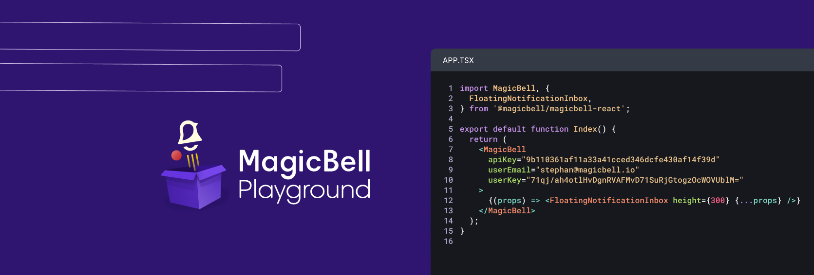

# MagicBell Playground

This web app offers an online playground with support for all MagicBell's web SDK's. All code samples in [/examples](examples) are hosted at  https://playground.magicbell.com.




## Getting Started

To run the local development environment, run:

```bash
npm run dev
# or
yarn dev
```

Open [http://localhost:3000](http://localhost:3000) with your browser to see the result.

You can start editing the playground by modifying `pages` and `components`, or modify code samples by editing files in `/examples`. The page auto-updates as you edit the file.

[API routes](https://nextjs.org/docs/api-routes/introduction) can be accessed on [http://localhost:3000/api/hello](http://localhost:3000/api/hello). This endpoint can be edited in `pages/api/hello.js`.

The `pages/api` directory is mapped to `/api/*`. Files in this directory are treated as [API routes](https://nextjs.org/docs/api-routes/introduction) instead of React pages.

# Creating Examples

Examples can be created in the `/examples` folder. The folder name that's being used for the example double serves as a page slug. In other words, the example `/examples/react-custom-bell-icon` will be available at `https://playground.magicbell.com/react-custom-bell-icon`.

The fastest way to create new examples is by cloning existing ones. There are currently four base examples:

| Framework  | SDK                        | Path                 |
| ---------- | -------------------------- | -------------------- |
| Angular    | @magicbell/embeddable      | /examples/angular    |
| JavaScript | @magicbell/embeddable      | /examples/embeddable |
| React      | @magicbell/magicbell-react | /examples/react      |
| Vue        | @magicbell/embeddable      | /examples/vue        |

All examples are set up to use the latest version of the SDK. Pinning versions, to show how something is done in a specific version of the SDK, or for a specific version of a dependency (like React), can be done via `package.json`.

Note that all examples work with presets. We do support full package.json configs, such as main files, and also declaring specific versions of depending libraries such as react, but when you'll go that route, you might lose some parts of the preset. 

The easiest way to do so is to open an example in CodeSandBox (click Fork) and download the example folder from there. You'll then see that each example has more files than Playground is showing, and you'll also get to see the full package.json as it's used at runtime. We hide that info for brevity.
